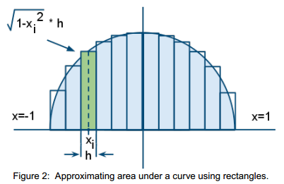
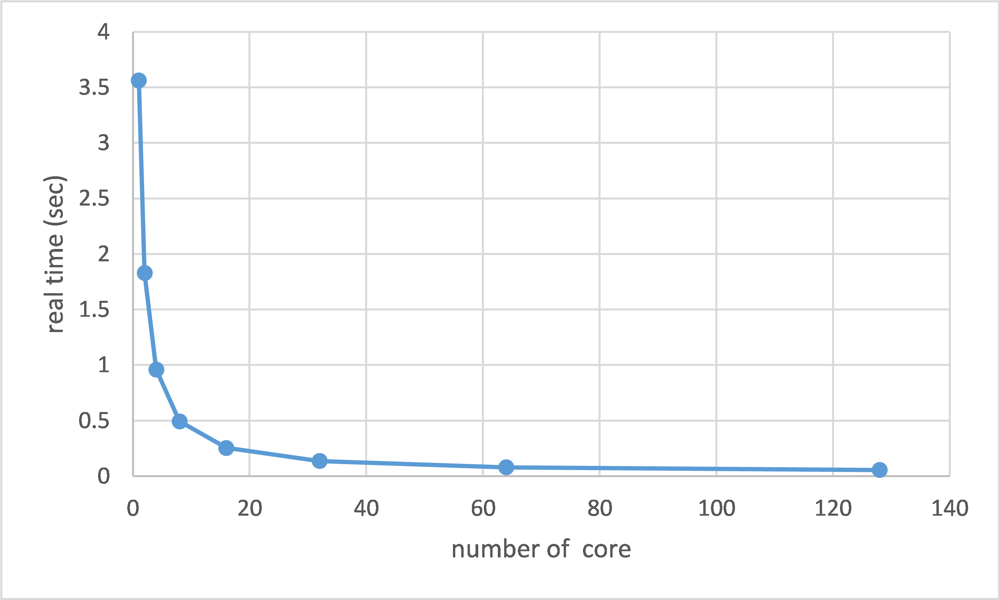

# Find pi using Numerical Integration
## Overview
Write a multi-threads code to accelerating the process of computing pi.
## Algorithmic Strategy
Compute π by finding the area of a unit circle, i.e., a circle with radius `r=1`. \
The formula for the unit circle is 
```
x2 + y2 = 1
```
\
Solving for y, we get the formula:
```
y=1−√1−𝑥2
```
Since the entire circle’s area is π, by adding up the areas of rectangles that approximately cover the area, we will find π.\

## Usage
```
./pi [core number]
``` 
## Parallel Computing
To see if more threads leads to less real time for computing:\

